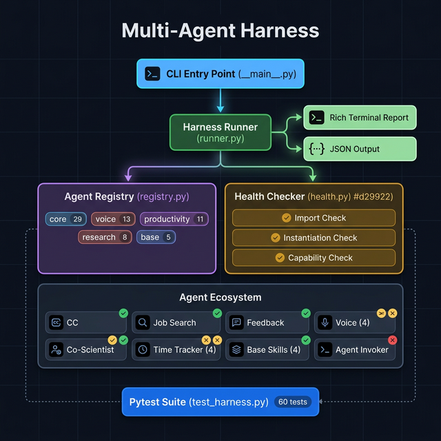

# 🤖 Multi-Agent Harness

**Discover, validate, and smoke-test every agent in the repository — with one command.**

The harness is your CI-friendly health-check system that ensures all agents can be imported, instantiated, and exercised before you ship changes.



---

## 🏗️ Architecture

The harness is built as a four-layer stack, each layer with a single responsibility:

### Layer 1 — CLI Entry Point (`__main__.py`)

The user-facing interface. Run the harness via `python -m harness` with flags for filtering, verbosity, and output format. Parses arguments and delegates to the runner.

### Layer 2 — Harness Runner (`runner.py`)

The orchestration engine. Iterates over every registered agent, invokes the health checker, collects results, and produces two output formats:

| Output | Use Case |
|---|---|
| **Rich Terminal Report** | Human review — color-coded ✅/❌/⏭️ per agent |
| **JSON Output** (`--json`) | CI pipelines — machine-readable results |

### Layer 3 — Core Components

Two components work together to discover and validate agents:

#### Agent Registry (`registry.py`)

A hard-coded manifest of **23 agent entries** across **5 categories**. Uses static registration rather than reflection because agents don't share a common base class — making the registry both more reliable and self-documenting.

```
┌─────────────────────────────────────────────────────┐
│  REGISTRY: 23 Agents × 5 Categories                │
│                                                     │
│  core (2)          │  voice (5)                     │
│  ├─ Feedback       │  ├─ Voice Coordinator          │
│  └─ Agent Invoker  │  ├─ Dictation Agent            │
│                    │  ├─ Productivity Voice Agent    │
│  productivity (8)  │  ├─ Ideas Capture Agent         │
│  ├─ CC Skills      │  └─ Dev Copilot Agent          │
│  ├─ CC Actions     │                                │
│  ├─ Job Search     │  research (2)                  │
│  ├─ Resume Skills  │  ├─ Co-Scientist Agent         │
│  ├─ Networking     │  └─ AI Agents Co-Scientist     │
│  ├─ Time Tracker   │                                │
│  ├─ Activity Mon.  │  base (4)                      │
│  ├─ Categorizer    │  ├─ Research Skills             │
│  ├─ Analytics      │  ├─ Social Skills              │
│  └─ Reporter       │  ├─ Context Skills             │
│                    │  └─ GitHub Skills              │
└─────────────────────────────────────────────────────┘
```

Each `AgentEntry` contains:

| Field | Description |
|---|---|
| `name` | Human-readable name |
| `module_path` | Dotted import path (`agents.cc.cc_skills`) |
| `class_name` | Class to instantiate (`CCSkills`) |
| `category` | Grouping for filtering |
| `deterministic_methods` | Methods safe to call without external deps |
| `init_kwargs` | Optional constructor arguments |

#### Health Checker (`health.py`)

Runs a progressive three-stage validation pipeline for each agent:

```
┌──────────────────────────────────────────────────────────┐
│                  Health Check Pipeline                     │
│                                                          │
│  Stage 1: IMPORT CHECK                                   │
│  ┌────────────────────────────────────────────────────┐  │
│  │  • Import the module via importlib                 │  │
│  │  • Verify the class exists on the module           │  │
│  │  • Missing pip packages → SKIP (not failure)       │  │
│  └──────────────────┬─────────────────────────────────┘  │
│                     │ pass?                               │
│                     ▼                                     │
│  Stage 2: INSTANTIATION CHECK                            │
│  ┌────────────────────────────────────────────────────┐  │
│  │  • Call cls(**init_kwargs) to construct the agent   │  │
│  │  • Missing credentials/config → SKIP               │  │
│  │  • Required constructor args → SKIP                │  │
│  │  • Unexpected exceptions → FAIL                    │  │
│  └──────────────────┬─────────────────────────────────┘  │
│                     │ pass & not skipped?                 │
│                     ▼                                     │
│  Stage 3: CAPABILITY CHECK                               │
│  ┌────────────────────────────────────────────────────┐  │
│  │  • Call deterministic methods with default args     │  │
│  │  • Verify they return a value without error        │  │
│  │  • e.g., CCSkills._get_greeting() → "Good morning" │  │
│  └────────────────────────────────────────────────────┘  │
└──────────────────────────────────────────────────────────┘
```

**Key design decision:** The health checker distinguishes between **failures** (broken code) and **skips** (missing infrastructure). Missing pip packages, API keys, OAuth tokens, and required constructor args are all treated as skips — the agent code itself is fine, it just can't run in this environment.

### Layer 4 — Agent Ecosystem

The actual agents being tested. The harness doesn't modify them — it validates them from the outside.

---

## 🚀 Usage

### Quick Start

```bash
cd /path/to/agents

# Run all checks
python3 -m harness

# With full tracebacks on failures
python3 -m harness --verbose
```

### CLI Options

| Flag | Description | Example |
|---|---|---|
| `--verbose`, `-v` | Show full tracebacks for failures | `python3 -m harness -v` |
| `--category` | Filter by category | `python3 -m harness --category voice` |
| `--json` | Machine-readable JSON output | `python3 -m harness --json` |
| `--list`, `-l` | List all registered agents | `python3 -m harness --list` |

### Category Filter

Run checks for only a specific group of agents:

```bash
python3 -m harness --category core          # 2 agents
python3 -m harness --category voice         # 5 agents
python3 -m harness --category productivity  # 8 agents
python3 -m harness --category research      # 2 agents
python3 -m harness --category base          # 4 agents
```

### JSON Output (CI Integration)

```bash
python3 -m harness --json | jq '.summary'
```

Output:
```json
{
  "agents_tested": 23,
  "total_checks": 47,
  "passed": 35,
  "failed": 0,
  "skipped": 12,
  "all_healthy": true
}
```

### Pytest Suite

```bash
# Run the full 60-test suite
python3 -m pytest tests/test_harness.py -v

# Run only import tests
python3 -m pytest tests/test_harness.py::TestAgentImports -v

# Run only instantiation tests
python3 -m pytest tests/test_harness.py::TestAgentInstantiation -v
```

---

## 📂 File Structure

```
harness/
├── __init__.py       # Package exports
├── __main__.py       # CLI entry point (python -m harness)
├── registry.py       # Agent manifest — 23 entries, 5 categories
├── health.py         # Import, instantiation, and capability checks
├── runner.py         # Orchestration + terminal/JSON reports
└── architecture.png  # Architecture diagram

tests/
├── conftest.py       # Path setup for pytest
└── test_harness.py   # 60 parametrized tests
```

---

## 🧪 Test Coverage

The pytest suite in `tests/test_harness.py` covers five areas:

| Test Class | Tests | What It Validates |
|---|---|---|
| `TestAgentRegistry` | 7 | Registry returns agents, no duplicates, categories exist |
| `TestAgentImports` | 23 | Every registered agent module is importable |
| `TestAgentInstantiation` | 23 | Every agent can be constructed (or gracefully skips) |
| `TestDeterministicCapabilities` | 2 | Deterministic methods return values |
| `TestHarnessRunner` | 5 | Runner produces correct results, filters, JSON |
| **Total** | **60** | |

---

## 🔧 Adding a New Agent

When you add a new agent to the repository, register it in `harness/registry.py`:

```python
AgentEntry(
    name="My New Agent",
    module_path="agents.my_agent.my_agent_module",
    class_name="MyNewAgent",
    category="productivity",  # core | voice | productivity | research | base
    description="What this agent does",
    deterministic_methods=["some_pure_method"],  # optional
),
```

Then run the harness to verify it passes all checks:

```bash
python3 -m harness --verbose
python3 -m pytest tests/test_harness.py -v
```

---

## 📊 Understanding Results

| Icon | Meaning |
|---|---|
| ✅ | All checks passed — agent is fully healthy |
| ⏭️ | Checks skipped — missing deps/credentials (agent code is fine) |
| ❌ | Check failed — broken code that needs fixing |

**Skips are expected** in environments without all pip packages or API credentials installed. The harness distinguishes between "can't run here" (skip) and "broken code" (fail).

---

## 🔗 Integration with CI

Add to your CI pipeline:

```yaml
# GitHub Actions example
- name: Agent Health Check
  run: |
    python3 -m harness --json > harness-results.json
    python3 -m harness  # human-readable output in logs
    
- name: Run Harness Tests
  run: python3 -m pytest tests/test_harness.py -v
```

The harness exits with code `0` on all-pass and `1` on any failure, making it CI-ready out of the box.
